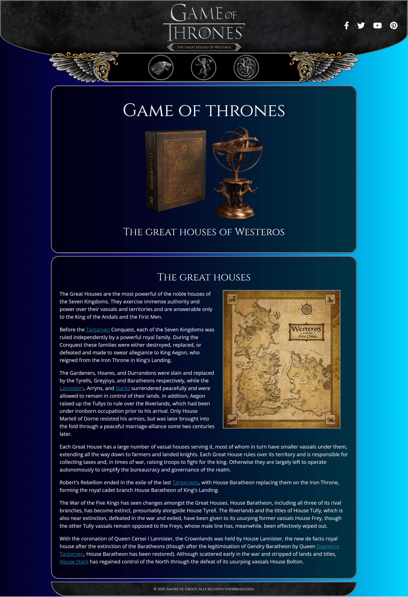

# College of Multimedia opdracht MM-2

__Opdrachtomschrijving__

Bouw met Dreamweaver een website. De website bevat een nieuws- en productengedeelte.

Deze opdracht hoeft niet responsive te worden gebouwd.

__Uitwerking opdracht__

[Live demo Game of Thrones](https://cmm-web-design-module-1-mm-2.netlify.app)

